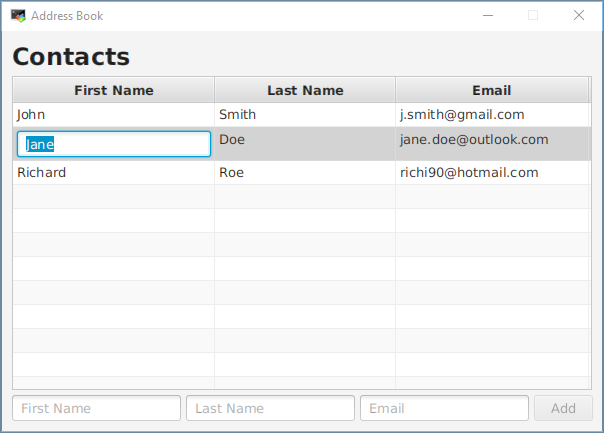
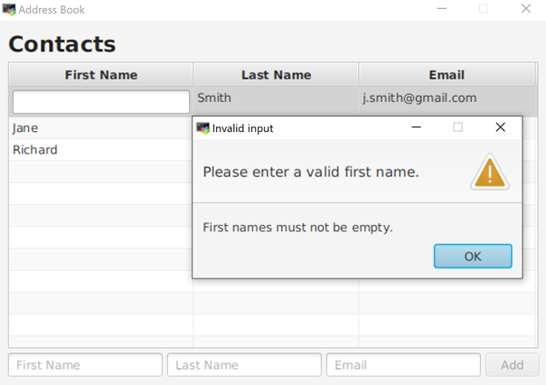
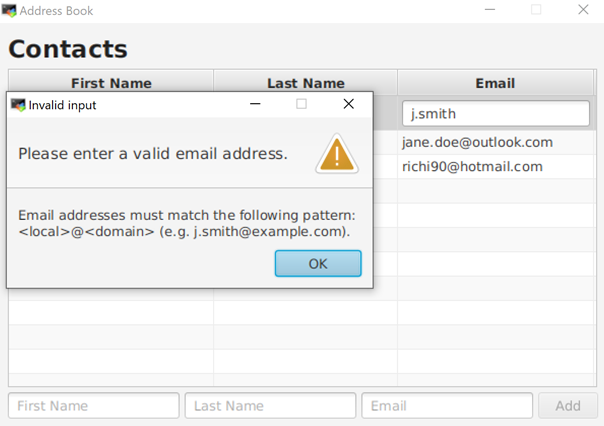

# Address Book

Ziel dieser Übung ist die Weiterentwicklung einer JavaFX-Applikation zur Verwaltung von Email-Kontakten. Im Startprojekt werden bereits das Hinzufügen und das Löschen von Kontakten und sowie die dazugehörigen Datenbankoperationen unterstützt.
## GUI
Erweitern Sie die Applikation, so dass die Kontakte in der Tabelle bearbeitet werden können:

Beachten Sie folgendes Detail: Das Drücken der `DELETE`-Taste soll während der Bearbeitung einer Zelle nicht zum Löschen der Person führen.

## Database
 
Implementieren Sie für das Updaten einer Person in der Datenbank folgende Methode:
 - `PersonRepository.savePerson(Person person)`
 
Entwickeln Sie außerdem einen Unit-Test um die Methode zu testen.

Updaten Sie beim Beenden der Applikation alle Personen in der Datenbank. Tipp: `App.stop()` überschreiben.

## Input Validation

Stellen Sie beim Bearbeiten in der Tabelle folgende Regeln sicher:
- Der Vor- und der Nachname dürfen nicht leer sein.
- Die Mailadresse muss dem Schema *local@domain* (z.B. *j.smith@example.com*) entsprechen.

Bei einem ungültigen Vornamen soll folgender `Alert` angezeigt werden:

Bei einer ungültigen Mailadresse soll folgender `Alert` angezeigt werden:

