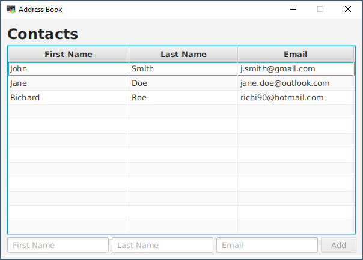

# Address Book

Ziel dieser Übungsaufgabe ist die Erstellung einer JavaFX-Applikation zur Verwaltung von Email-Kontakten. Damit die Daten dauerhaft zur Verfügung stehen, werden diese in einer Datenbank gespeichert.

## Graphical User Interface
Die Oberfläche der Anwendung soll folgendermaßen aufgebaut sein:

Die GUI soll folgende Funktionen unterstützen:

- Hinzufügen einer neuen Person durch Anklicken des `Add`-Buttons
- Entfernen der in der `TableView` ausgewählten Person durch Drücken der `DELETE`-Taste

Dabei soll sich die Applikation folgendermaßen verhalten: 
 - Nachdem ein Eintrag zur `TableView` hinzugefügt wurde, sollen die Textfelder wieder leer sein.
 - Falls mindestens eines der Textfelder leer ist, soll der `Add`-Button deaktiviert sein.
 - Falls die `TableView` leer ist, soll die `DELETE`-Taste wirkungslos sein.
 
## Database
 
Implementieren Sie für das Auslesen der Personen aus der Datenbank folgende Methode:
 - `PersonRepository.getAllPersons()`
 
Verwenden Sie für Änderungen an der `PERSON`-Tabelle folgende Methoden:
 - `PersonRepository.addPerson(Person person)` ist bereits vorhanden.
 - `PersonRepository.removePerson(Person person)` muss noch von Ihnen implementiert werden.
 
Entwickeln Sie außerdem Unit-Tests um die Methoden `getAllPersons()` und `removePerson()` zu testen.